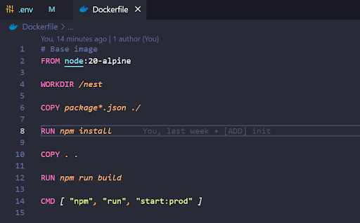
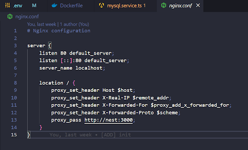
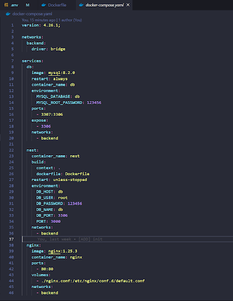
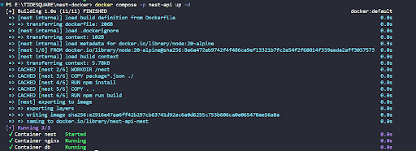
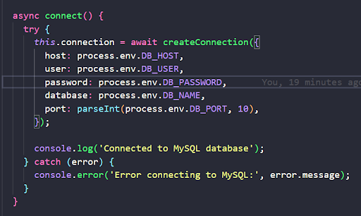
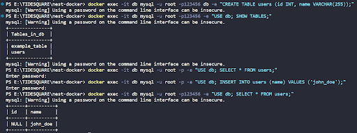
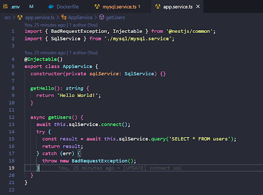
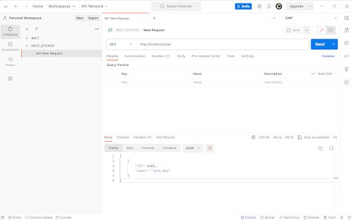

#### 1. Init Nestjs project
#### 2. Dockerfile build nest app


#### 3. Nginx config


#### 4. Docker compose stack


#### 5. Run container
```bash
docker compose -p nest-api up -d
```


#### 6. Connect mysql


#### 7. Insert data into mysql table
> Create table users
```bash
docker exec -it db mysql -u root -p123456 db -e "CREATE TABLE users (id INT, name VARCHAR(255));"
```
> Show tables
```bash
docker exec -it db mysql -u root -p123456 -e "USE db; SHOW TABLES;"
```
> Insert data into users
```bash
docker exec -it db mysql -u root -p -e "USE db; INSERT INTO users (name) VALUES ('john_doe');"
```
> Show users
```bash
docker exec -it db mysql -u root -p -e "USE db; INSERT INTO users (name) VALUES ('john_doe');"  
```


#### 8. API get users


#### 9. Demo postman
